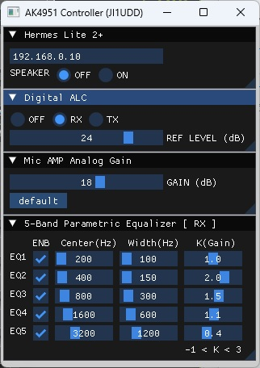
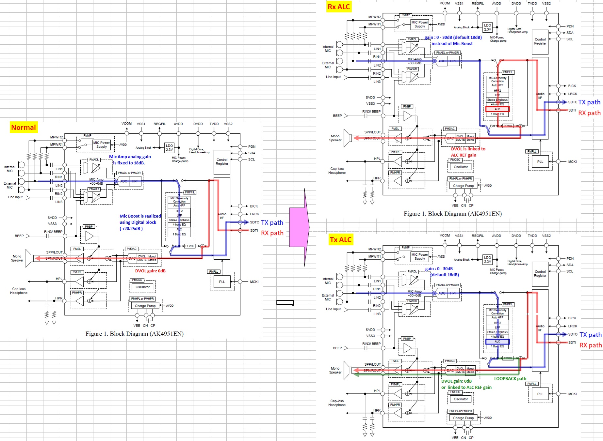

# ak4951_Controller
Windows application software for configuring the AK4951 on the Hermes Lite2 companion board via network. 

## Start Up
  Set your HL2+ IP address to text box and then click "SET" botton.
  Note: If IP address is changed after clicked "SET" botton, AK4951 Controller should be restarted.

## Use case
### Case 1: Rx audio limitter
1. Select "RX" button on Digital ALC panel.
2. Set "REF LEVEL" to 0.
3. Adjust volume slider on Thetis to your desired volume.
4. Increase "REF LEVEL" to the point where the volume you monitor begins to drop.

- The above settings will help avoid excessively loud receiver audio. 
- 5-Band Parametric Equalizer can be used on the receiver audio. 
- Mic gain can be set from 0 dB to 30 dB.

### Case 2: Mic audio limitter with gain
1. Select "TX" button on Digital ALC panel.
2. At first, set "REF LEVEL" (reference level) to 0. 
3. Press "default" button to set Mic AMP analog gain to 18dB.
4. Check both loopback and link-DAC-ATT checkbox.
       Speakers will automatically turn off to prevent unnecessary feedback (howling).
5. While speaking into a microphone at normal volume, increase "REF LEVEL" 
       to the point where the volume you monitor in your headphones begins to drop.
       The above settings allow for proper gain settings that avoid saturation.
6. In addition, if REF LEVEL is big value, increase Mic AMP gain and then repeat step 5.
       Amplifying with Mic AMP analog gain may result in better sound quality than amplifying
       with high REF LEVEL digitally.
7. If necessary, uncheck link-DAC-ATT checkbox to check the audio that is sent to Thetis.
8. At last, uncheck loopback checkbox.

- 5-Band Parametric Equalizer can be used on the audio from Mic.

### Case 3: limitter OFF (Normal)
- Mic gain (Boost) is set on SDR software (Thetis,..).
- 5-Band Parametric Equalizer can be used on the audio from Mic.

### AK4951 audio data path

March 3, 2026  JI1UDD